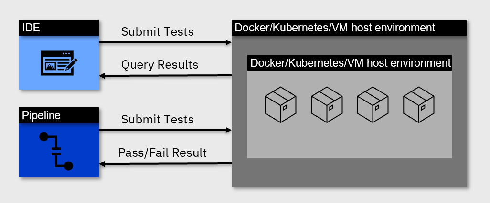
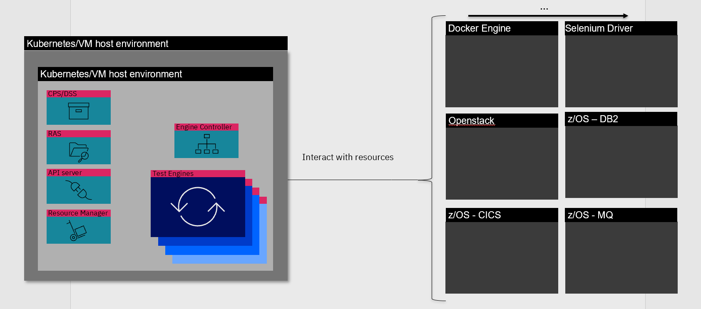

The Galasa ecosystem contains all of the servers and monitors that are required to run Galasa tests in an automated environment or DevOps pipeline. The following diagram provides a high-level representation of the Galasa ecosystem architecture:   

 The ecosystem is made up of a collection of microservices for orchestrating runtimes, monitoring tests and resources, and providing clean-up of those resources if required. The ecosystem provides a centralized store for run configurations, a single location for storing all test results and test artifacts, and utilizes a REST endpoint that can be called from any IDE or pipeline. 

### Key components:

The following diagram highlights a some of the key components that make up the Galasa ecosystem and examples of external resources with which Galasa can interact: 

 Expand the following sections to find out more about the key components of the Galasa ecosystem:

Galasa Stores

|                                   |                                                                                                                          |
| ------------------------------------- | :----------------------------------------------------------------------------------------------------------------------------------- |
| **Configuration Property Store**                       | The configuration property store (CPS) defines object properties, topologies, system configurations, and definitions which instruct the way in which a Galasa test runs. For example, properties for endpoints, ports and timeouts. When running in an ecosystem, all Galasa tests will use the same CPS configuration, unless any overrides are passed at submission. Defining properties in the CPS enables tests to run against multiple environments without changing the code inside the test.          |
| **Dynamic Data Store**               | The dynamic data store (DSS) provides status information about the ecosystem and the tests that are running. The DSS is used by the resource manager and engine controller to ensure the limits that are set in the CPS configuration are not exceeded. DSS property values change dynamically as tests are run, showing the resources that are currently being used, shared or locked by a test, so that workloads can be limited to avoid throttling. When running in automation, the DSS is shared by every instance of the framework.                                                             |
| **Result Archive Store**                      | The result archive store (RAS) is a single database which stores all elements of a test, including the test results, run logs, and test artifacts. These elements can be used to help diagnose the cause of any failures encountered as a result of running a test, or to gather information about a test.  Storing all of this information in one place makes it simple for entire teams to view results.                              |
| **Credentials Store**                   | The credentials store (CREDs) securely provides the credentials, for example, password, username and authentication token that are required for a test to run in automation. The CREDs is hosted in the etcd server.    |
| **Certificate Store**      | If you are using certificates in your ecosystem, you can store them in the certificate store.                                                                  |

Galasa Servers

|                                   |                                                                                                                          |
| ------------------------------------- | :----------------------------------------------------------------------------------------------------------------------------------- |
| **Engine controller**                       | The engine controller enables tests to run at scale within the ecosystem. This service is responsible for instantiating individual test engines by creating Docker containers or Kubernetes pods to manage and execute individual Galasa automation test runs. The engine controller allocates a test engine to a test submission if the required resources for the test are available. Otherwise, the test is put into a waiting state to be run at an appropriate time.        |
| **etcd**                       | The etcd server is a highly available key-value pair store which hosts the Configuration Property Store (CPS), the Dynamic Status Store (DSS) and the Credentials Store (CREDs). The CPS, DSS contain information that are used by all tests and the CREDs is used only for automation runs.  The etcd server stores and maintains a single, consistent source of the truth about the status of the ecosystem at any given point in time.      |
| **CouchDB**                       | This database runs inside Docker container or Kubernetes pod and contains the Result Archive Store (RAS).        |
| **Resource Management**                       | The resource management service monitors running tests and resources that have been marked as in use. If a test case becomes stale or is ended manually, this service performs clean up actions to ensure that the resources are entered back into the pool for another test to use. This service
can perform large pieces of work, including the de-provisioning of an environment.   |
| **Metrics Server**                       | The metrics server indicates the health of the ecosystem, for example, providing metrics on the number of successful test runs.        |
| **API Server**                       |  The API server acts as a central point from which to control the Galasa ecosystem and is used by Galasa as an endpoint with which IDEs and pipelines interact for submitting tests and retrieving results. The API server hosts the bootstrap server and the Manager API server.  >      |
| **Bootstrap Server**                       | The bootstrap server is part of the API server. The bootstrap is an endpoint that is provided by the API server to store the initial configuration required to instantiate a Galasa framework. When setting up the Galasa ecosystem, the Eclipse IDE must be updated to point to the bootstrap that is configured to use the ecosystem.      |
| **Manager API Server**                       | A Manger to Manger type API. The API is used to host web services that can be called from the Galasa WebUI or from external services such as Jenkins.     |
| **Web UI**                       | Use the WebUI to see a dashboard overview of the current and historical health of the Galasa framework. The UI can also run, schedule or reschedule tests, be used to analyse output from failed test runs, and manage the configuration needed to customise the framework and  tests for maximum throughput, resilience and flexibility.        |
| **LDAP authentication server (Optional)**                       | This server is planned for a future release to provide the ability to authenticate through an LDAP server.       |

Code Deployment

|                                   |                                                                                                                          |
| ------------------------------------- | :----------------------------------------------------------------------------------------------------------------------------------- |
| **Maven Repositories and OBRs**                       | For tests to run in the ecosystem they require compiled artifacts to be hosted in a Maven repository. The artifacts must be bundled as an OSGI bundle -  Galasa provides a Maven plug-in to create these bundles.       |
| **Nexus**                       | A Nexus server enables deployment of Maven artifacts to the ecosystem and can be used to host Docker images.     |

Optional reporting servers

|                                   |                                                                                                                          |
| ------------------------------------- | :----------------------------------------------------------------------------------------------------------------------------------- |
| **Prometheus**                       | The Prometheus server scrapes and stores metrics from defined endpoints from the metrics server. These metrics can be displayed in a Grafana dashboard.   |
| **Grafana**                       | A dashboard for visualizing Prometheus metrics. Data can be explored through queries and drilldown.       |
| **Elasticsearch**                       | Provides an Elastic search instance to record the results of automated test runs.        |
| **Kabana**                       | A dashboard for visualizing Elasticsearch metrics. Data can be explored through queries and drilldown.       |

