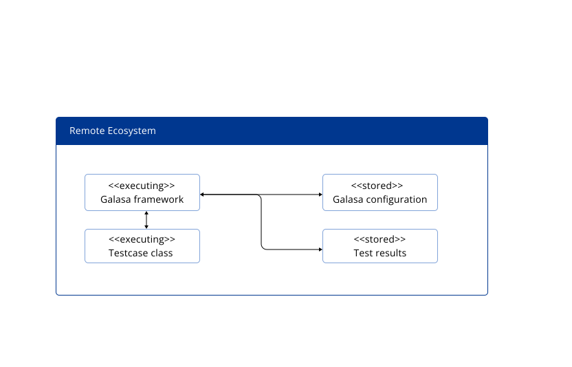
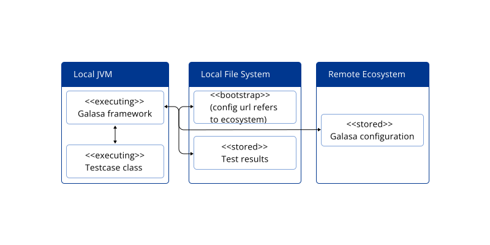

[Overview](#overview)<br>
[Running a test locally](#locally)<br>
[Running a test in the Ecosystem](#remotely)<br>
[Running a test locally but using shared configuration](#hybrid)<br>
[When to run a test in the Ecosystem](#whenremote)<br>
[When to run a test locally](#whenlocal)<br>


## <a name="overview"></a>Overview

There are three modes in which you can run a Galasa test:<br><br>
-  locally, with everything running on the local machine<br>
-  locally but using a shared configuration that is hosted by the Galasa Ecosystem<br>
-  remotely, by submitting the test to run in the Galasa Ecosystem<br> 


If you are running a test locally but using a shared configuration that is hosted by the Galasa Ecosystem, or running a test remotely by submitting the test to run in the Galasa Ecosystem, you are interacting with the Galasa Ecosystem. 

Before you can interact with the Galasa Ecosystem, you must authenticate with it by using a personal access token. Tokens are stored in the `GALASA_TOKEN` in the `galasactl.properties` in your Galasa home folder. You can request a personal access token by using the Galasa Web UI. For more information about setting up authentication with an Ecosystem, see the [Configuring authentication](../ecosystem/ecosystem-authentication) documentation.


The mode in which you choose to run a test depends on what you are trying to achieve. Use the following information to understand which mode is most appropriate for a given scenario. 


## <a name="locally"></a>Running a test locally


When you run a test locally, without using shared configuration, everything runs on your local machine. The Galasa bootstrap file is blank and makes no reference to an Ecosystem. The Galasa framework is launched within the JVM on the local machine and the local file system holds all the configuration that is used by the test. The test runs in the local JVM and all test results and artifacts are stored on the local disk. 


You can run a test in this mode by using the `runs submit local` <a href="https://github.com/galasa-dev/cli/blob/main/docs/generated/galasactl_runs_submit_local.md" target="_blank"> Galasa CLI</a> command.


## <a name="remotely"></a>Running a test in the Galasa Ecosystem

To submit your test to an Ecosystem for remote execution, the Galasa bootstrap is set to the URL of the Galasa Ecosystem in which you want to run your test. The configuration of the test is also held within that Ecosystem, and Galasa starts up in a container in which the test code will run. The test results and artifacts are stored in a database within the specified Ecosystem, and users on client machines can view the test results. 




After configuring authentication, you can run a test in this mode by setting up your bootstrap file to refer to the Ecosystem that you want to use and running the `runs submit` <a href="https://github.com/galasa-dev/cli/blob/main/docs/generated/galasactl_runs_submit.md" target="_blank"> Galasa CLI</a> command.

## <a name="hybrid"></a>Running a test locally but using shared configuration

When you run a test locally, but using shared configuration, the Galasa bootstrap is set to the URL of the Galasa Ecosystem where the shared configuration is stored. The Galasa framework is launched within the JVM on the local machine, but the framework consults the remote Ecosystem to read configuration data, but not the credentials properties as these are drawn from a local file. This is the key difference between running a test in this "hybrid" mode versus running a test locally without using shared configuration. In hybrid mode, the test still runs in the local JVM and all test results and artifacts are stored on the local disk. 




To run tests in hybrid mode, add the following properties into your local `bootstrap.properties` file:

```
framework.config.store=galasacps://my.ecosystem.url/api
framework.extra.bundles=dev.galasa.cps.rest
```

where: <br>
- `galasacps://my.ecosystem.url/api` tells Galasa that `https://my.ecosystem.url/api` is the location of the Ecosystem REST API and <br>
- `framework.extra.bundles` indicates that the Galasa framework should load the `dev.galasa.cps.rest` extension. This extension tells the Galasa framework how to handle URLs that start with `galasacps` as the *scheme* part of the URL. <br>


After configuring authentication, you can run a test in hybrid mode by setting your bootstrap to refer to the Ecosystem in which the shared configuration is stored, and using the `runs submit local` <a href="https://github.com/galasa-dev/cli/blob/main/docs/generated/galasactl_runs_submit_local.md" target="_blank"> Galasa CLI</a> command. 

### <a name="whenremote"></a>When to run a test in the Galasa Ecosystem

Running a test remotely is useful in the following scenarios:


- <b>Tests need to run in bulk, in parallel, often submitted by different automation jobs or people, in an environment where resources are limited and need to be managed between tests. For example, ports, slots of processing capability, files, and sessions.</b> 

If you are able to dynamically provision a system, then running tests from a local JVM can work well, as the system under test might have few resource contraints and can be used exclusively by the tests before being de-provisioned. However, if you want to run many test in parallet, you cannot do so reliably from a single system using the local JVM method on one user account. Any contention to name test runs uniquely, or other stateful changes in the test framework might cause the tests to clash, over-write each other, fail, or produce unexpected results. Running multiple tests in series can avoid some of these issues but running large numbers of tests in this way can take a long time. 

To reliably run many tests in parallel, deploy your tests to the Galasa Ecosystem, letting the Ecosystem manage the test runs, and the Galasa Manager components manage any shared or constrained resources. 

- <b>Test results and reports need gathering from a single point. For example, when test results need reporting or exporting to another report-generating system, or when bug investigation can proceed by independent inspection test results and artifacts.</b>

A problem faced in large-scale use of the local JVM method of test invocation is how to gather test results from disparate machines or environments, so that the test results can be combined and form test reports for system health monitoring. This is something that running tests within a Galasa Ecosystem handles well, as the results of each test are stored centrally. Test results can be shared with others, enabling independent inspection and debugging of run artifacts. 

- <b>When the clean-up of resources in the system under test is an important requirement</b>

When you run tests in a Galasa Ecosystem, resources are cleaned up by the Managers that are called during abnormal test exit conditions. When a locally run test stops prematurely, the Manager code that handles the clean-up of allocated resources might not run, so resources are not cleaned up. Over time, this can result in performance degradation of the system under test. 


### <a name="whenlocal"></a>When to run a test locally

Running a test locally is useful when you are doing the following types of task:

- Developing tests, and running those tests against a non-production environment.

- Running ad-hoc tests against a development or non-production target system.

- When there is time to find and share test run logs and artifacts with bug investigators, whenever a test fails and finds a bug.


